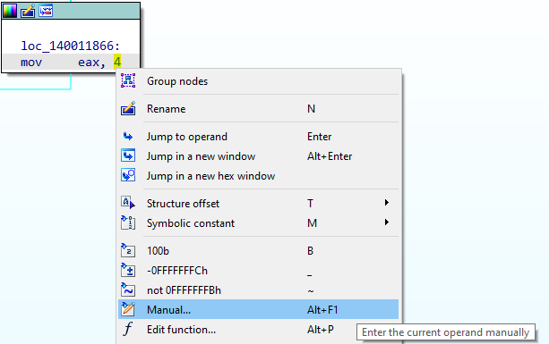
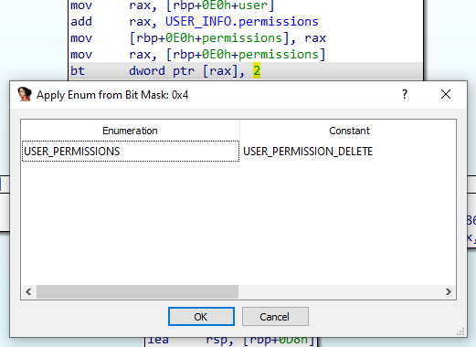

# IDA Bit Test Plugin

## Problem
IDA doesn't handle bit tests for bit flags well in the decompiled output. For example:


<sup>Example bit test instruction</sup>

If you try to assign an enumeration value for ```2h``` in the code, it looks for enumerations having a member with a literal value of ```0x2``` . Instead, we want to check for a member with the value ```0x1 << 0x2```, which is actually ```0x4```.

## Background
If you already know about bit fields and bit flags, feel free to skip ahead to the [[IDA Bit Test Plugin#implementation]].

**What are bit flags?**
Bit flags are a compact way to represent a small set of binary values. For example, say your program has the concepts of users, and that different users have different permissions:

```C
typedef struct USER_INFO 
{
	char* name;
	unsigned char read_access;
	unsigned char write_access;
	unsigned char delete_access;
}
```

Notice that we're using three bytes here to capture user permission information. However, these permissions are binary (they're either 1 or 0 - *allowed* or *denied*). So really we only need 3 bits to store these permissions. They could be stored within a single byte variable called permissions:

```C
typedef struct  
{
	char* name;
	unsigned char permissions;
} USER_INFO;
```

But how can we reference the permissions individually if they're stored in a single byte? In C, there's a simple way to define these flags within a *bit field* structure.

```C
typedef struct  
{
	char* name;
	struct 
	{
		unsigned char read_access: 1;
		unsigned char write_access: 1;
		unsigned char delete_access: 1;
	} permissions;
} USER_INFO;
```

The compiler will determine that only 3 bits are being used in the *permissions* structure, and compress the size to be a single byte. Now, our user permissions field looks like this:

| 7 | 6 | 5 | 4 | 5 | 2 | 1 | 0 |
|-|-|-|-|-|-|-|-|
| N/A | N/A | N/A | N/A | N/A | Delete | Write | Read |

We can create a user and reference the permissions as follows:
```C
// Create a user, Bob, and grant them read access.
USER_INFO user_bob = { 0 };
user_bob.name = "Bob";
user_bob.permissions.read_access = 1;
```

We can also use the fields to determine access for a given user:
```C
#define WRITE_ACCESS_MASK 0x02

// Does the user have write access?
if (user->permissions.write_access) {
	// Let them write!
	...
}
```

When the code above is compiled, it will result in something like this:
```assembly
mov eax, [ecx+8] 		;; Move the permissions byte into the al register
and eax, 1h				;; Test if bit 1 is set (write_access)
test eax, eax			;; Was it set?
jnz WRITE_ALLOWED		;; If so, they can write!
```

However, if the developer is using ```_bittest()```, it will look something like this;
```assembly
mov al, byte ptr [ecx+8] ;; Move the permissions byte into the al register
bt al, 1h				 ;; Test if bit 1 is set (write_access)
jnz WRITE_ALLOWED		 ;; If so, they can write!
```

**Why is this a problem?**
When you're dealing with someone else's code, you may not have the structure definition for a user, or maybe you don't even have access to user instances at all. Say there exists an API to create users:

```C
int CreateUser(char* Name, USER_PERMISSIONS Flags);
```

In this example, you need to provide a name, and the permissions for a user. The API header likely provides constants or an enumeration for you to specify flags:

```C
// USER_PERMISSIONS
#define USER_PERMISSION_READ 0x1
#define USER_PERMISSION_WRITE 0x2
#define USER_PERMISSION_DELETE 0x4
```

So we can create a user
```C
int return_code = CreateUser("Bob", USER_PERMISSIONS_READ | USER_PERMISSIONS_WRITE);
```

Now we have *two ways* to check permissions. Internally, the software stores it as a bit field, and might perform bit tests to check for permissions, but externally we just have constant values. 

If we are reverse engineering this application, can create an enumeration in IDA called *USER_PERMISSIONS* that has the constants described above (this would be automatically generated in cases where a PDB exists for the binary). 

Imagine we're happily reverse engineering the program, and see the following code:


<sup>Example of a bit mask being applied</sup>

Awesome, we see ```and eax, 4```, we use our handy Enum hotkey 'M', and choose *USER_PERMISSIONS_DELETE*.

But what if we saw a test for *USER_PERMISSIONS_DELETE* that looks like this:


<sup>Example of a bit test being applied</sup>

Now, we can't use the *USER_PERMISSIONS* enumeration directly anymore, since the value is ```0x2```, which in our enumeration is *USER_PERMISSION_WRITE*. Instead, we need to calculate the value which corresponds to bit ```0x2``` being set. 

Ok, yeah, this is a *very* trivial example, but to be thorough: to calculate the *mask* that corresponds to the bit test, we shift the value ```0x1``` by the position of the bit being tested, in this case ```0x2```. So:
```0x1 << 0x2 = 0x4```

So a bit test of ```0x2``` corresponds to a bit mask of ```0x4```, which means we're really testing if *USER_PERMISSIONS_DELETE* is enabled, just like our previous example. 

This was a simple example that you could do in your head, but it quickly becomes a nuisance with higher bit test values or many different enumerations.

## Implementation

### Preparation
Since I hadn't written a GUI plugin before, I decided to look for some previous examples on github. I had previously used some of the [FireEye FLARE plugins](https://github.com/fireeye/flare-ida), and they provided a good starting point for this project.

### Plugin Module, Scriptable Plugin, or Script?
IDA provides users various means of extending functionality. Depending on the complexity of your task, you might choose one over the others.

| Type | Overview |
| - | - |
| Plugin Module | Written using the IDA SDK, these plugins are DLLs which export the *PLUGIN* symbol which gets invoked when IDA starts up. | 
| Scriptable Plugin | Written using the scripting API, these are written in C or Python and declare a function *PLUGIN_ENTRY* which should return a plugin_t instance |
| Script | Written using the scripting API, these are invoked by the user, and while they can perform similar functionality to a scriptable plugin, they are not loaded and unloaded automatically like native plugins |

I decided to write a scriptable plugin in Python, both because my reference examples were written in Python, and because I'm more comfortable using it to design rapid prototypes than C/C++.

### Use Case
What is the use case for this plugin? 
> 1. A user comes across a bit test instruction
> 2. They want to see if it refers to a known enumeration.
> 3. Aided by the context in which this bit test was found (i.e. where they are in the code), they can launch a dialog box which allows them to choose the appropriate enum constant.
> 4. Once chosen, the constant value in the disassembly is replaced with the chosen constant name.

Defining the use case helped me plan out the work. I tried to identify the essential pieces first to avoid writing a GUI and hooking everything up only to discover that something basic like finding an enumeration isn't feasible.

So here are my tasks:
1. Take a bit test value and find a matching enumeration. If we can't do this, there's no point writing a GUI.
2. Replace a constant value in the code with the matched enumeration name.
3. Create a dialog box, populated with the values discovered in (1)
4. Allow the user to choose (or not) an enumeration to apply.

### Going from a Bit Test to an Enum Constant
This part sounds pretty simple. How can we take a bit test instruction in IDA and find all matching enum constants? 

```python
# Shift the value to get our search parameter
enum_value = 1 << int(bit_test_value)

# Go through all loaded enums to see if it's in there
enum_count = ida_enum.get_enum_qty()
matches = []
for i in range(enum_count):
	enum_id = ida_enum.getn_enum(i)
	if not enum_id:
		continue

	enum_is_bitfield = ida_enum.is_bf(enum_id)
	if enum_is_bitfield:
		# If the enum is a bitfield which contains (binary) flags, chances are
		# the mask for each member is equal to the flag.
		const_id = ida_enum.get_enum_member(enum_id, enum_value, 0, enum_value)
	else:
		# Otherwise, no mask!
		const_id = ida_enum.get_enum_member(enum_id, enum_value, 0, 0)
	# Returns BADNODE if not found
	if const_id != ida_netnode.BADNODE:
		# Looks legitimate, grab the enum name and const name
		const_name = ida_enum.get_enum_member_name(const_id)
		enum_name = ida_enum.get_enum_name(enum_id)
		matches.append((const_name, enum_name))
```

### Replacing a Constant with an Enum
IDA lets you manually define the representation of a given operand. You can set it to any string that you want! To accomplish this manually, you can right click on a variable and select "Manual" to enter a custom string:


<sup>Manual operands in IDA</sup>

There's also an API to accomplish this:
```python
ida_bytes.set_forced_operand(effective_address, operand_index, manual_string)
```

> Ok, full-disclosure here, I think there's a better way to do this, but I couldn't sort it out. IDA supports the concept of custom datatypes (```ida_bytes.data_format_t```). Instead of replacing the operand with a 'Manual' definition, I think we could have assigned a custom datatype which would also be displayed when you right click on an *immediate* value. I followed the [API example](https://github.com/idapython/src/blob/master/examples/core/custom_data_types_and_formats.py), but it would never display my type. If you know how to do this, let me know!

### Create a Dialog Box
This seemed like it would be the most daunting task However, IDA Pro supports using PyQt5 since 2015, and the tools make this pretty straightforward.

#### Install Tooling
IDA already includes the PyQt5 libraries, but we can also install *QtDesigner* to create the dialog box, and the *Qt User Interface Compiler (uic)* to compile it:
```
pip install pyqt5
pip install pyqt5-tools
pip install PyQt5Designer
```

This will install *QtDesigner* in your site-packages, e.g.:
```Python39\Lib\site-packages\QtDesigner\designer.exe```

And *uic* in your python distribution's scripts folder, e.g.:
```Python39\Scripts\pyuic5.exe```

#### Use QtDesigner to Create a Form
Launch QtDesigner, and create a new form ```File->New```

Choose the default template *Dialog without Buttons*, then *Create*. Now we have a basic dialog box:


<sup>Creating a QtDialog</sup>


Add a *Table Widget* to the dialog box, then add a *Dialog Button Box* below it:


<sup>Adding a QTableWidget and QDialogButtonBox</sup>

Now, right click in the gray space (the *Dialog* area) and select *Lay out->Lay Out Vertically*. Your components will automatically expand to fit the box:


<sup>Laying our components out Vertically</sup>

We want to display two columns for each value we matched for our bit test, the enumeration and the constant within it:
* Right-click within the *QTableWidget* (the white space), and select *Edit Items*. 
* In the *Columns* tab, hit the '+' symbol, and name it *Enumeration*. Do this again and name the second column *Constant*. Click OK to exit this menu.


<sup>Adding columns to our dialog box</sup>

Now we'll do a bunch of little tweaks to make it a bit more presentable. We can edit the properties of each component by selecting them in the *Object Inspector* window which is pinned at the top right by default. 

Here are the changes to make (leave all other defaults):

**QDialog**
QObject->objectName: BitTesterDialog
QWidget->geometry->Width: 420
QWidget->geometry->Height: 300
QWidget->sizePolicy->Horizontal Policy: Ignored
QWidget->sizePolicy->Vertical Policy: Ignored
QWidget->windowTitle: Apply Enum from Bit Test Value
QDialog->sizeGripEnabled: true

**QDialogButtonBox**
QDialogButtonBox->centerButtons: true

**QTableWidget**
QAbstractItemView->editTriggers: NoEditTriggers
QAbstractItemView->alternatingRowColors: true
QAbstractItemView->selectionMode: SingleSelection
QAbstractItemView->selectionBehaviour: SelectRows
QTableView->showGrid: false
QTableView->sortingEnabled: true
Header->horizontalHeaderMinimumSectionSize: 200
Header->horizontalHeaderStretchLastSection: true
Header->verticalHeaderVisible: false

Save the layout. *QtDesigner* will output an xml representation of your form. This can be compiled to produce a python representation using the *Qt User Interface Compiler (uic)*. 

##### Edit Signals and Slots
This is the part where we wire up user-interaction with the form to python methods. We haven't created our dialog component in python yet, but that doesn't matter for this step.

Select *Edit->Edit Signals/Slots*. You'll notice that when you hover over your form, the different components will be highlighted in red. 

First, we want to wire up our *OK* and *Cancel* buttons. This means we want to wire the *accepted()* method of the *QDialogButtonBox* to the *accept()* method of our *QDialog*, and likewise we want to connect *rejected()* to the *reject()* method. 

This is really simple to accomplish, just click anywhere within the OK/Cancel button area, and drag the connection to the *QDialog*. Since our components are filling up the whole box, the easiest way is to just drag to the very top of our dialog component (where our window title is). We can see the signals and slots displayed for both components, so select *accepted()*, then *accept()*. Repeat for *rejected()* and *reject()*:


<sup>Configuring our signals and slots</sup>

What if the user just double clicks on a row in the form? We can handle that, too. Click within our *QTableWidget* and drag to the top of the *QDialog* component like we did for our buttons. Choose *cellDoubleClicked(int, int)* and *accept()*. 

That's it! We'll see how to use this data when we create our *QDialog* instance later on.

#### Use uic to Compile our Form
If you installed ```pyqt5-tools```, then ```pyuic5``` might be on your system path. Otherwise, it's within your python distribution's Scripts folder: ```Python39\Scripts\pyuic5.exe```.

Just point it at the *.ui* file we created, and it will print out the compiled python, which we can just redirect to a *.py* file as follows:
```powershell
C:\My\Project\Folder> pyuic5.exe .\bit_tester_.ui > bit_tester_ui.py

```

Great, that's our dialog box, now we just need to add our data to it, present it to the user on-demand, and capture their decision to change display values in IDA.

#### Create our Dialog Component
In our plugin code, we need to create an instance of our dialog box to display. If we want to extend or add any functionality to the dialog box, we should extend *QWidgets.QDialog*. Here's what we can do:

```python
from PyQt5 import QtCore, QtGui, QtWidgets

class BitTesterWidget(QtWidgets.QDialog):
    
    def __init__(self, valueStr, parent=None):
        QtWidgets.QDialog.__init__(self, parent)
        self.logger = init_logger('bittester_widget')
        try:
            self.ui = Ui_BitTesterDialog(valueStr)
            self.ui.setupUi(self)
        except Exception as e:
            self.logger.exception(f'Initialization error: {e}')

    @property
    def table(self):
        return self.ui.tableWidget

    def getChoice(self):
        rowData = self.table.selectedItems()
        if not rowData:
            return None, None
        enumChoice = rowData[0].text()
        constChoice = rowData[1].text()
        return enumChoice, constChoice

    def addEnumEntry(self, constName, enumName):
        curRow = self.table.rowCount()
        self.table.insertRow(curRow)
        self.table.setItem(curRow, 0, QtWidgets.QTableWidgetItem(enumName))
        self.table.setItem(curRow, 1, QtWidgets.QTableWidgetItem(constName))
```

During initialization, we set our `ui` property (inherited from *QDialog*) to an instance of the class we just compiled using `uic`. The code for that class is below. We add a convenience `@property` to reference our table, as well as two methods:
* addEnumEntry, which will insert a row into our table; and
* getChoice, which returns the user-selected data in the table

#### UI Code
Here's the UI code we generated using `uic` with a couple of tweaks mentioned below:
```python
class Ui_BitTesterDialog(object):

	def __init__(self, valueStr):
        self.logger = init_logger('bittester_ui')
        self.valueStr = valueStr

    def setupUi(self, BitTesterDialog):
        BitTesterDialog.setObjectName("BitTesterDialog")
        BitTesterDialog.resize(420, 199)
        sizePolicy = QtWidgets.QSizePolicy(QtWidgets.QSizePolicy.Ignored, QtWidgets.QSizePolicy.Ignored)
        sizePolicy.setHorizontalStretch(0)
        sizePolicy.setVerticalStretch(0)
        sizePolicy.setHeightForWidth(BitTesterDialog.sizePolicy().hasHeightForWidth())
        BitTesterDialog.setSizePolicy(sizePolicy)
        BitTesterDialog.setSizeGripEnabled(True)
        self.verticalLayout = QtWidgets.QVBoxLayout(BitTesterDialog)
        self.verticalLayout.setObjectName("verticalLayout")
        self.tableWidget = QtWidgets.QTableWidget(BitTesterDialog)
        sizePolicy = QtWidgets.QSizePolicy(QtWidgets.QSizePolicy.Expanding, QtWidgets.QSizePolicy.Expanding)
        sizePolicy.setHorizontalStretch(0)
        sizePolicy.setVerticalStretch(0)
        sizePolicy.setHeightForWidth(self.tableWidget.sizePolicy().hasHeightForWidth())
        self.tableWidget.setSizePolicy(sizePolicy)
        self.tableWidget.setEditTriggers(QtWidgets.QAbstractItemView.NoEditTriggers)
        self.tableWidget.setAlternatingRowColors(True)
        self.tableWidget.setSelectionMode(QtWidgets.QAbstractItemView.SingleSelection)
        self.tableWidget.setSelectionBehavior(QtWidgets.QAbstractItemView.SelectRows)
        self.tableWidget.setShowGrid(False)
        self.tableWidget.setObjectName("tableWidget")
        self.tableWidget.setColumnCount(2)
        self.tableWidget.setRowCount(0)
        item = QtWidgets.QTableWidgetItem()
        self.tableWidget.setHorizontalHeaderItem(0, item)
        item = QtWidgets.QTableWidgetItem()
        self.tableWidget.setHorizontalHeaderItem(1, item)
        self.tableWidget.horizontalHeader().setMinimumSectionSize(200)
        self.tableWidget.horizontalHeader().setStretchLastSection(True)
        self.tableWidget.verticalHeader().setVisible(False)
        self.verticalLayout.addWidget(self.tableWidget)
        self.buttonBox = QtWidgets.QDialogButtonBox(BitTesterDialog)
        self.buttonBox.setStandardButtons(QtWidgets.QDialogButtonBox.Cancel|QtWidgets.QDialogButtonBox.Ok)
        self.buttonBox.setCenterButtons(True)
        self.buttonBox.setObjectName("buttonBox")
        self.verticalLayout.addWidget(self.buttonBox)

        self.retranslateUi(BitTesterDialog)
        self.buttonBox.accepted.connect(BitTesterDialog.accept)
        self.buttonBox.rejected.connect(BitTesterDialog.reject)
        self.tableWidget.doubleClicked['QModelIndex'].connect(BitTesterDialog.accept)
        QtCore.QMetaObject.connectSlotsByName(BitTesterDialog)

    def retranslateUi(self, BitTesterDialog):
        _translate = QtCore.QCoreApplication.translate
    	if self.valueStr:
            BitTesterDialog.setWindowTitle(_translate("BitTesterDialog", f"Apply Enum from Bit Test Value: {self.valueStr}"))
        else:
            BitTesterDialog.setWindowTitle(_translate("BitTesterDialog", f"Apply Enum from Bit Test Value"))
        self.tableWidget.setSortingEnabled(True)
        item = self.tableWidget.horizontalHeaderItem(0)
        item.setText(_translate("BitTesterDialog", "Enumeration"))
        item = self.tableWidget.horizontalHeaderItem(1)
        item.setText(_translate("BitTesterDialog", "Constant"))
```

We add an `__init__` method to the UI component to create a logger, and also pass a `valueStr` parameter. This was added so we can display the bit mask in the window title, accomplished by the following:

```python
   	if self.valueStr:
        BitTesterDialog.setWindowTitle(_translate("BitTesterDialog", f"Apply Enum from Bit Test Value: {self.valueStr}"))
    else:
        BitTesterDialog.setWindowTitle(_translate("BitTesterDialog", f"Apply Enum from Bit Test Value"))
```

Why would we be invoked without a value? If the user isn't on a line that has a valid immediate value, we still pop the dialog to behave like the built-in enumeration plugin (although the *\<NEW\>* functionality has yet to be implemented!).

##### Logging

Finally, there's a couple of calls to `init_logger`. Personally, I like to have discrete loggers when I'm learning about different things to make it clear what component I've messed up. Here's that method:

```python
import logging
LOG_LEVEL = logging.DEBUG
def init_logger(logger_name:typing.AnyStr, 
                log_level:typing.SupportsInt=LOG_LEVEL) -> logging.Logger:
    """Generate a logger for the given name. 
       If one already exists (as determined by existing handlers), 
	   it is returned.

    Args:
        logger_name (string): desired logger name
        log_level (level e.g. logging.DEBUG, optional): defaults to LOG_LEVEL.

    Returns:
        logging.Logger: logger
    """
    logger = logging.getLogger(logger_name)
    if logger.handlers:
        # It's already initialized, return it.
        return logger
    formatter = logging.Formatter(
	    '[%(asctime)s %(levelname)-9s] %(name)s: %(message)s'
	)
    console = logging.StreamHandler()
    console.setFormatter(formatter)
    console.setLevel(log_level)
    logger.addHandler(console)
    logger.setLevel(log_level)
    return logger
```

### Create an IDA Plugin

#### Plugin/Action Registration
We need a way for the user to pop our dialog box and choose an enumeration. For this, we can use IDA's [plugin_t](https://www.hex-rays.com/products/ida/support/sdkdoc/classplugin__t.html) class.

```python

ACTION_NAME = "Enum (bit flag)"
PLUGIN_DISPLAY_NAME = "Enum from Bit Flag"
PLUGIN_HELP = "Searches imported enumerations for a bit flag which match the bit test value"
PLUGIN_SHORTCUT = "Alt+Shift+M"
PLUGIN_COMMENT = "Apply an enumeration from a bit flag location"
PLUGIN_MENU_PATH = "Edit/Operand type/Enum member..."

class bit_tester_plugin_t(idaapi.plugin_t):

    # These members are defined in the plugin_t spec
    flags = 0
    comment = PLUGIN_COMMENT
    help = PLUGIN_HELP
    wanted_name = PLUGIN_DISPLAY_NAME
    wanted_hotkey = ""

    def init(self): 
        self.logger = init_logger('bit_tester_plugin_t')
        # Create the plugin action
        if hasattr(sys.modules['idaapi'], '_ks_bit_tester_installed'):
            return
        action_desc = idaapi.action_desc_t(
            ACTION_NAME,
            PLUGIN_DISPLAY_NAME,
            ApplyEnumHandler(),
            PLUGIN_SHORTCUT,
            PLUGIN_COMMENT
        )
        
        if not idaapi.register_action(action_desc):
            raise Exception(f"Failed to register action.")

        # Register in the menu
        if not ida_kernwin.attach_action_to_menu(
            PLUGIN_MENU_PATH,
            ACTION_NAME,
            idaapi.SETMENU_APP
        ):
            raise Exception(f"Failed to attach action to menu.")
        setattr(sys.modules['idaapi'], '_ks_bit_tester_installed', True)
        return idaapi.PLUGIN_OK

    def run(self, arg):
        self.logger.debug("run invoked")

    def term(self):
        self.logger.debug("term invoked")

def PLUGIN_ENTRY():
    try:
        return bit_tester_plugin_t()
    except Exception as e:
        idaapi.msg(f"Failed to initialize plugin: {e}\n")
        raise e
```

Some takeaways from the code above:
* When your .py file is in IDA's `plugins` folder, the `PLUGIN_ENTRY` method will be called on startup. Your job is to return a valid `plugin_t` instance.
* Our plugin only does a few things:
	1. Checks to see if we're already "installed". This is kind of a hack that the FireEye code did, but I couldn't find another way to prevent our plugin trying to re-register itself when we load a new IDB file.
	
	2. Registers an *action*, which is accomplished by creating an [action_desc_t](https://www.hex-rays.com/products/ida/support/sdkdoc/structaction__desc__t.html) object, and calling `register_action` with it. Within our action_desc, we need to provide an [action_handler_t](https://www.hex-rays.com/products/ida/support/sdkdoc/structaction__handler__t.html) instance. This is an instance of our `ApplyEnumHandler` class, described below.
	
	3. Adds an entry to the "Edit->Operand type" menu.

#### Plugin Action Handler
Now, whenever the user presses Alt+Shift+M (chosen because it is *kind of* close to the enum shortcut "M"), our handler is invoked. Here's the handler code:
```python
class ApplyEnumHandler(idaapi.action_handler_t):
    
    def __init__(self, *args, **kwargs):
        self.logger = init_logger('apply_enum_handler')
        super().__init__(*args, **kwargs)
        self.logger.debug(f"ApplyEnumHandler initialized.")

    def display_ui(self, bit_test_value):
        matches = []
        value_str = ''
        if bit_test_value:
            # Shift the value to get our search parameter
            enum_value = 1 << int(bit_test_value)
            value_str = hex(enum_value)
            # Go through all loaded enums to see if it's in there
            enum_count = ida_enum.get_enum_qty()
            
            for i in range(enum_count):
                enum_id = ida_enum.getn_enum(i)
                if not enum_id:
                    continue
                
                enum_is_bitfield = ida_enum.is_bf(enum_id)
                if enum_is_bitfield:
                    # If the enum is a bitfield which contains (binary) flags, chances are
                    # the mask for each member is equal to the flag.
                    const_id = ida_enum.get_enum_member(enum_id, enum_value, 0, enum_value)
                else:
                    # Otherwise, no mask!
                    const_id = ida_enum.get_enum_member(enum_id, enum_value, 0, 0)
                # Returns BADNODE if not found
                if const_id != ida_netnode.BADNODE:
                    # Looks legitimate, grab the enum name and const name
                    const_name = ida_enum.get_enum_member_name(const_id)
                    enum_name = ida_enum.get_enum_name(enum_id)
                    matches.append((const_name, enum_name))        
        # Populate and show the dialog box
        dialog = BitTesterWidget(value_str)
        for match in matches:
            const_name, enum_name = match
            dialog.addEnumEntry(const_name, enum_name)
        dialog.table.resizeRowsToContents()
                
        old_timeout = idaapi.set_script_timeout(0)
        res = dialog.exec_()
        idaapi.set_script_timeout(old_timeout)
        if res != QtWidgets.QDialog.Accepted:
            self.logger.debug('Dialog rejected')
            return None, None
        
        self.logger.debug('Dialog accepted. Fetching values.')

        enum_choice, const_choice = dialog.getChoice()
        return enum_choice, const_choice          

    def activate(self, ctx):
        self.logger.debug(f"activate()\n")
        """ This is when we actually get invoked via click """
        # Make sure there's actually an untyped value we can use on the current line
        value = None
        operand_type = None
        for operand_idx in [0,1]:
            operand_type = idc.get_operand_type(ctx.cur_ea, operand_idx)
            if  operand_type == idc.o_imm:
                self.logger.debug(f"Found immediate at 0x{ctx.cur_ea:08x}, operand {operand_idx}")
                op_value = idc.get_operand_value(ctx.cur_ea, operand_idx)
                if op_value != -1 and op_value < 64:
                    value = int(op_value)
                    break
        
        if value is None:
            # Originally wasn't going to pop a form here, but then the user might think the
            # plugin is broken..
            self.logger.debug(f"No immediate values less than 64 to check on current line.")
        else:
            # Make a form with all detected instances of the enumeration values
            self.logger.debug(f"Launching UI for immediate 0x{value:08x}")
        
        enum_choice, const_choice = self.display_ui(value)
        if not const_choice:
            return True
        
        # Apply it
        self.logger.debug(f'User wants to apply {const_choice} from {enum_choice}')
        if not ida_bytes.set_forced_operand(ctx.cur_ea, operand_idx, const_choice):
            self.logger.error(f"set_forced_operand failed.")
        return True

    def update(self, ctx):
        self.logger.debug("update()")
        """ This determines whether the action is available """
        # Only valid in the disassembly widget
        if ctx.widget_type != ida_kernwin.BWN_DISASM:
            return ida_kernwin.AST_DISABLE_FOR_WIDGET
        
        # Only valid when there's a selection
        return ida_kernwin.ACF_HAS_SELECTION
        
```

Some takeaways from the code above:
* Your action handler has to implement two important methods:
	1.  `def update(self, ctx)`, which is invoked when the UI context changes. The method should return whether the action should be enabled in the current context, and when it should be queried for availability again.
	2.  `def activate(self, ctx)`, which is invoked when your action is triggered. This is where your core behaviour should be implemented.

The `ctx` parameter passed to these methods is a [action_ctx_base_t ](https://www.hex-rays.com/products/ida/support/sdkdoc/structaction__ctx__base__t.html) instance, which has many useful properties like `cur_ea`, `cur_func`, etc. so that your action can save time by not having to query for contextual information.

### Putting it all Together
To recap, we have created:
	* Code to convert a bit test value to a bit mask, and then find all applicable loaded enums and constants
	* Code to set an immediate value to a manual string in the disassembly view
	* A dialog box using *QtDesigner*, compiled to python with *uic*
	* An action handler, which:
		* converts a bit test value to an existing enum constant
		* finds all applicable enums for the constant
		* creates a custom dialog box and populates it with our enum data
		* receives the user selection, and modifies the disassembly view to show their selected enum constant
	* A plugin instance, which registers our action+handler
		
We can put everything into a single .py file to make it easy to "install" the plugin. The resulting code is only ~300 lines of python. 

Here's an example usage of the finished product:


<sup>Our plugin in action!</sup>

Thanks for sticking it out and reading this article. I hope it proves useful if you're writing your own plugin.


